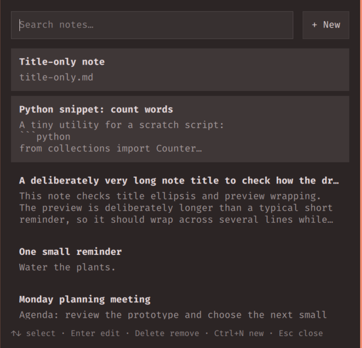
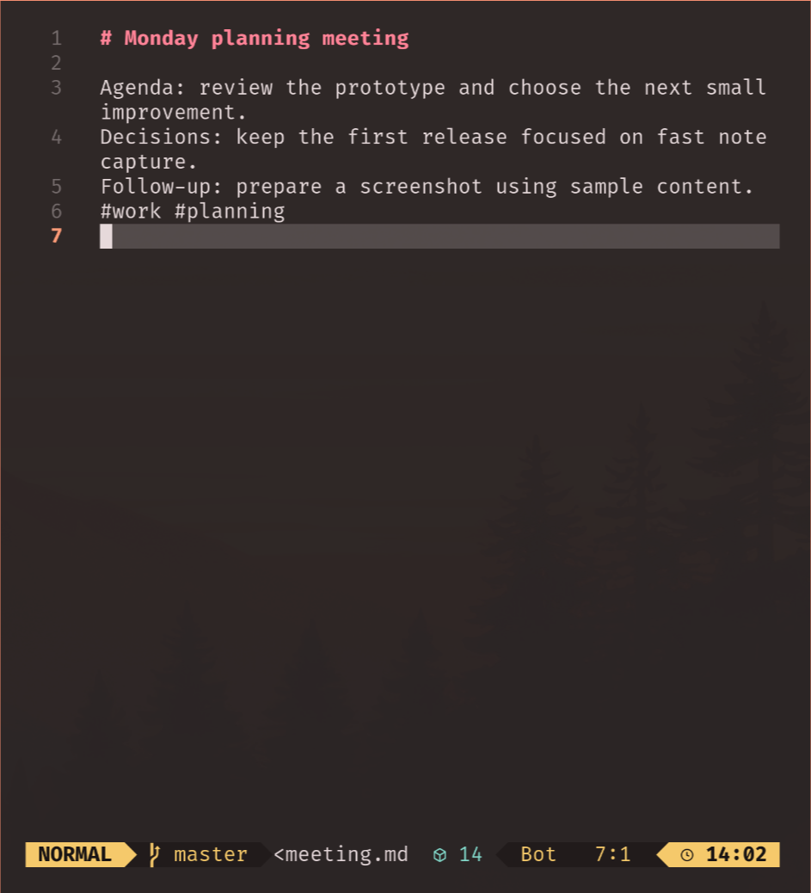

# omanb

An Omarchy bar widget for [nb](https://github.com/xwmx/nb): search, preview, create, edit, and delete notes in your current notebook, including indexed subfolders. Uses Omarchy's theme and opens notes in your configured nb editor.

| Browse notes | Edit in Neovim |
| --- | --- |
|  |  |

## What it does

- Click the bar icon to search titles, filenames, and short previews, newest edits first.
- Click a note or use Up/Down and Enter to edit it.
- **+ New**, Ctrl+N, or right-clicking the bar icon creates a note.
- Delete removes the selected note immediately through nb; Escape closes the popup.
- Refreshes every five seconds while open. Attachments and bookmarks stay in nb.

**Super+N** opens notes and **Super+Alt+N** creates a note. Each shortcut is registered automatically only if that combination is unused. Existing bindings take precedence. The plugin removes its own shortcuts when disabled or removed.

**Super+W** asks Neovim to save before closing a plugin-launched terminal. Ordinary Neovim sessions and other windows retain their existing close behavior. If the Hyprland close integration is incompatible, Super+W falls back to its normal behavior.

Switch notebooks with `nb notebooks use <name>`; list them with `nb notebooks`.

## How it works

`Notes.qml` provides the themed dropdown. `notes.py` asks nb for indexed notes, reads short previews, and launches your nb editor in Omarchy's default terminal. nb handles storage and Git history. `close.py` finds Neovim by a per-terminal session marker and requests its save prompt. `Shortcuts.qml` and `shortcuts.py` manage runtime Hyprland integration and restore it after configuration reloads.

## Setup

Requires **Omarchy Quattro**, **Python 3.9+**, and **nb** on `PATH` (or at `~/.local/bin/nb`). Install nb using its [setup instructions](https://github.com/xwmx/nb#installation), then run `nb` to initialize a notebook and configure your editor.

Install the plugin:

```sh
omarchy plugin add https://github.com/dmitry-solomadin/omanb.git --enable
```

Choose a bar section when prompted; the default is the right section.

See [shortcut customization](docs/shortcuts.md) for alternative bindings, the optional nb-shell shortcut, and details of the Neovim save prompt.

## Remove

```sh
omarchy plugin disable io.github.dmitry-solomadin.omanb
omarchy plugin remove io.github.dmitry-solomadin.omanb
```

Remove any optional keybindings you added and reload Hyprland. Your notebooks and nb installation are kept.

## License

MIT — see [LICENSE](LICENSE).
